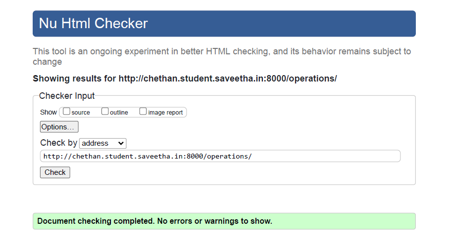
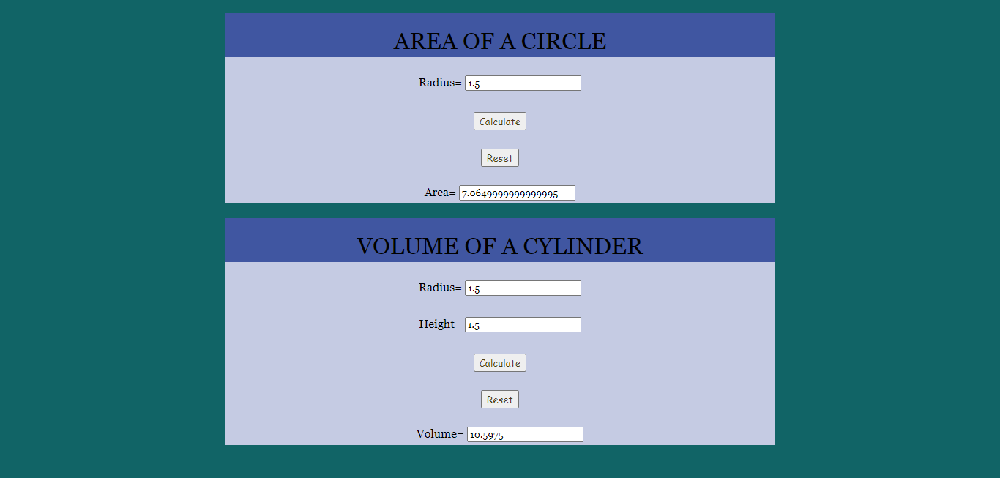

# Mathematical Calculations using JavaScript
## AIM:
To design a website to calculate the area of a circle and volume of a cylinder using JavaScript.

## DESIGN STEPS:
### Step 1: 
Requirement collection.
### Step 2:
Creating the layout using HTML and CSS.
### Step 3:
Write JavaScript to perform calculations.
### Step 4:
Choose the appropriate style and color scheme.
### Step 5:
Validate the layout in various browsers.
### Step 6:
Validate the HTML code.
### Step 7:
Publish the website in the given URL.


## PROGRAM:

### operations.html
```

<!DOCTYPE html>
<html>

<head>
    <title>Mathematical Operations</title>
    <link rel="stylesheet" href="">
</head>

<body>
    <div class="container">
        <div class="formview">
            <div class="banner">
                AREA OF A CIRCLE
            </div>
            <div class="content">
                <form action=" " method="GET">
                    
                    <div class="forminput">
                        <label for="value_r">Radius=</label>
                        <input type="text" name="value_r" id="value_r">
                    </div>
                    <div class="forminput">
                        <button type="button" name="button_cal" id="button_cal">Calculate</button>
                    </div>
                    <div class="forminput">
                        <button type="reset" name="reset" id="reset">Reset</button>
                    </div>
                    <div class="forminput">
                        <label for="value_c">Area=</label>
                        <input type="text" name="value_c" id="value_c">
                    </div>
                </form>
            </div>
        </div>
    </div>
    <div class="container">
        <div class="formview">
            <div class="banner">
                VOLUME OF A CYLINDER
            </div>
            <div class="content">
                <form action=" " method="GET">
                    
                    <div class="forminput">
                        <label for="value_r1">Radius=</label>
                        <input type="text" name="value_r1" id="value_r1">
                    </div>
                    <div class="forminput">
                        <label for="value_h">Height=</label>
                        <input type="text" name="value_h" id="value_h">
                    </div>
                    <div class="forminput">
                        <button type="button" name="button_cal1" id="button_cal1">Calculate</button>
                    </div>
                    <div class="forminput">
                        <button type="reset" name="reset" id="reset">Reset</button>
                    </div>
                    <div class="forminput">
                        <label for="value_v">Volume=</label>
                        <input type="text" name="value_v" id="value_v" >
                    </div>
                </form>
            </div>
        </div>
    </div>
    <script src="/static/js/mathscript.js"></script>
</body>

</html>
```
### mathscript.css
```
*{
      box-sizing: border-box;
      font-family: Georgia;
}

body, html{
    margin-top: 0px;
    margin-right: 0px;
    margin-bottom: 0px;
    margin-left: 0px;
    padding-top: 0px;
    padding-right: 0px;
    padding-bottom: 20px;
    padding-left: 0px;
    background-color: #116466;
}

.container{
    width: 750px;
    margin-left: auto;
    margin-right: auto;
}

.formview{
    justify-content: center;
    margin-top: 20px; 
}

.forminput{
    height: 50px;
    font-size: medium;
    padding-top: 25px;
}

.banner{
    display: block;
    width: 100%;
    background-color: #4056a1;
    padding-top: 20px;
    text-align: center;
    height: 60px;
    font-size: xx-large;
}

.content{
    display: block;
    width: 100%;
    background-color: #c5cbe3;
    text-align: center;
}

button{
    color: #4E3C14;
    font-family: cursive;
}

```
### mathscript.js
```
areaBtn= document.querySelector('#button_cal');
areaBtn1= document.querySelector('#button_cal1');

areaBtn.addEventListener('click',function(e){

    txtR= document.querySelector('#value_r');
    txtC= document.querySelector('#value_c');

    let c;

    c= 3.14*parseFloat(txtR.value)*parseFloat(txtR.value);
    txtC.value=c;

});

areaBtn1.addEventListener('click',function(f){

    txtR1= document.querySelector('#value_r1');
    txtH= document.querySelector('#value_h');
    txtV= document.querySelector('#value_v');

    let v;

    v= 3.14*parseFloat(txtR1.value)*parseFloat(txtR1.value)*parseFloat(txtH.value);
    txtV.value=v;
});
```
## CODE VALIDATION REPORT:


## OUTPUT:


## RESULT:
Thus a website is designed for Mathematical Operations and is hosted in the URL http://chethan.student.saveetha.in:8000/operations. HTML code is validated.